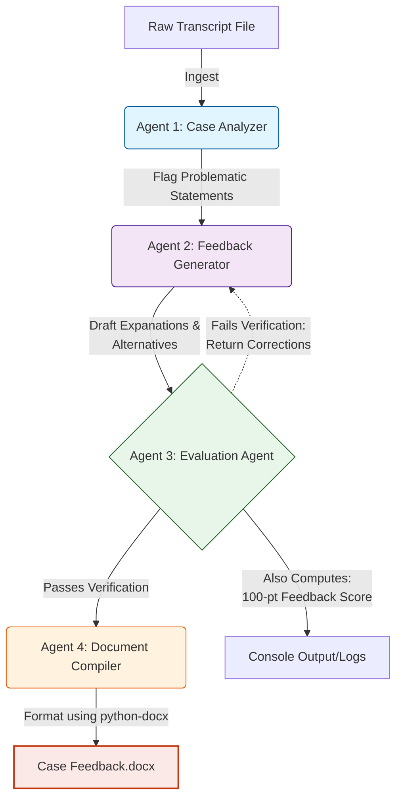

# Implementation Plan: Multi-Agent Customer Service Feedback System

## Overview
This implementation plan outlines the architecture, data flow, and processing strategy for the **Multi-Agent Customer Service Feedback System**. The system automates the evaluation of bank customer service chat transcripts, generated tailored feedback, verifies it against strict quality standards, and compiles the results into a professional Word document.

---

## 1. System Architecture & Components

The system is orchestrated by `main.py` which manages a sequential four-agent pipeline powered by OpenAI's GPT-4o model.

### Agent 1 — Case Analyzer (`agents/case_analyzer.py`)
- **Role:** Data Extraction & Classification
- **Function:** Reads raw chat transcripts and identifies problematic statements made by the customer service representative.
- **Rules Engine (System Prompt):** Evaluates statements against 7 categories (Tone, Clarity, Empathy, Grammar/Spelling, Professionalism, Problem Resolution, Accuracy).
- **Constraints:** Must only flag the representative (never the customer), must quote verbatim from the transcript.
- **Temperature:** 0.2 (Optimised for deterministic extraction)

### Agent 2 — Feedback Generator (`agents/feedback_generator.py`)
- **Role:** Content Creation
- **Function:** Takes the flagged statements and generates constructive, professional feedback.
- **Rules Engine:** Must provide a 1-3 sentence explanation using category terminology and propose a substantively different professional alternative.
- **Constraints:** Prohibited from introducing new Personally Identifiable Information (PII) or overpromising outcomes beyond the representative's control.
- **Temperature:** 0.3 (Balances consistency with the creativity needed for alternative generation)

### Agent 3 — Evaluation Agent (`agents/evaluation_agent.py`)
- **Role:** Quality Assurance & Human Performance Evaluation
- **Task 1 (Agent Validation):** Verifies Agent 2's output by checking transcript accuracy (character matches), explanation quality (length, terminology), alternative quality (PII/overpromise checks), and professional tone.
- **Task 2 (LLM Evaluation):** Computes a 100-point rubric score and `score_justification` representing the quality of the AI generated feedback itself, using Pydantic structured output models.
- **Feedback Loop:** If the feedback generated by Agent 2 fails verification OR scores below the minimum passing threshold (85/100), Agent 3 returns specific correction instructions alongside the score deduction back to Agent 2 for an automated rewrite (up to 5 retries).
- **Temperature:** 0.1 (Maximal strictness)

### Agent 4 — Document Compiler (`agents/document_compiler.py`)
- **Role:** Formatting & Compilation (Deterministic Python script)
- **Function:** Uses `python-docx` to compile the approved JSON feedback into `Case Feedback.docx`.
- **Formatting Constraints:** Ensures 1.5 line spacing, bold case headings, bulleted items, and a maximum length under 5 pages.

---

## 2. Visual Architecture Diagram

---

## 3. Data Flow Pipeline

1. **Initialization:**
   - `main.py` loads environment variables (`OPENAI_API_KEY`).
   - Reads `case_one.txt`, `case_two.txt`, and `case_three.txt` from the `transcripts/` directory.

2. **Sequential Processing (Iterated per case):**
   - **Step A:** Transcript $\rightarrow$ Agent 1 $\rightarrow$ Problematic Statements (JSON)
   - **Step B:** Statements + Transcript $\rightarrow$ Agent 2 $\rightarrow$ Draft Feedback (JSON)
   - **Step C:** Draft Feedback + Transcript $\rightarrow$ Agent 3 $\rightarrow$ Verification & Agent Score (JSON)
   - **Step D (Conditional):** If Verification fails $\rightarrow$ Pass Corrections to Agent 2 $\rightarrow$ Regenerate $\rightarrow$ Re-verify.

3. **Compilation:**
   - All approved feedback items are passed to Agent 4 to generate the final Word document.

4. **Logging:**
   - Every system step, interaction, retry attempt, and final numeric Agent Score is written to a structured markdown file (`notes_log.md`) for auditability.

---

## 3. Evaluation & Quality Metrics

The system's final output is evaluated against a predefined, 100-point rubric located in `evaluation_plan.md`:
- **Correctness (25pts):** Verbatim matching and accurate issue identification.
- **Completeness (20pts):** Coverage across all three cases and required layout components.
- **Clarity (15pts):** Clear explanations and natural-sounding alternatives.
- **Format (20pts):** Strict adherence to `.docx` formatting constraints (1.5 spacing, bold headers, 5-page limit).
- **Usefulness (20pts):** Actionability and correct professional tone for the banking domain.

---

## 4. Risk Mitigation Strategies

- **Hallucination:** Guarded by Agent 3's strict character-by-character validation of transcript statements.
- **Data Privacy:** Explicit prompts prohibit Agent 2 from inventing new PII not already present in the source text.
- **Runaway Token Costs:** The automated verification loop is hard-capped at a configurable variable (`MAX_VERIFICATION_RETRIES`, default: 2).
- **Formatting Variability:** Instead of asking the LLM to write markdown or attempt to construct binary files, formatting is handled entirely by predictable Python logic (`python-docx`) in Agent 4.
